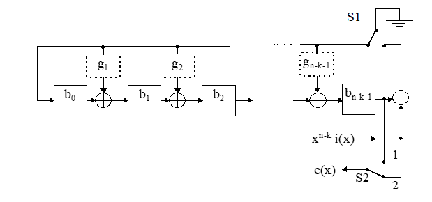
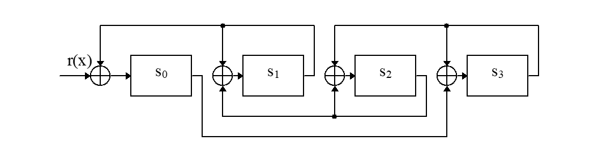
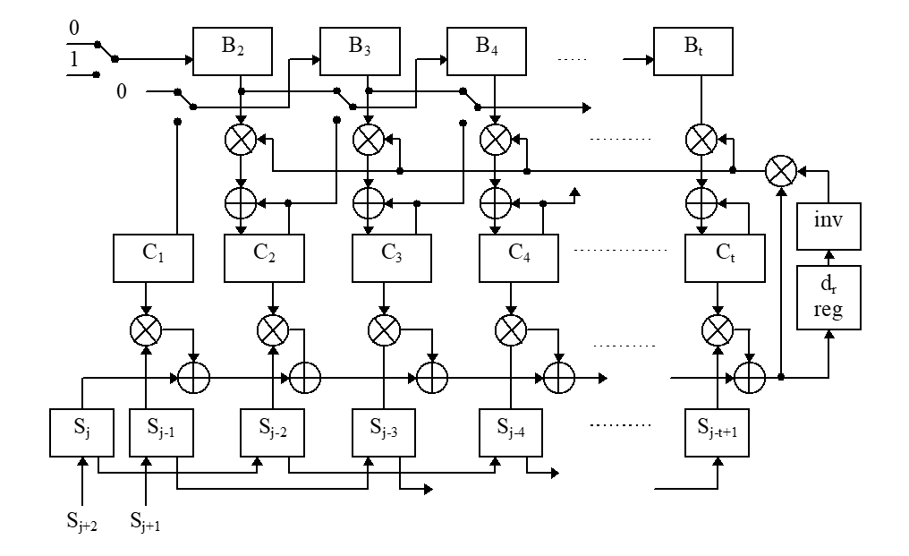
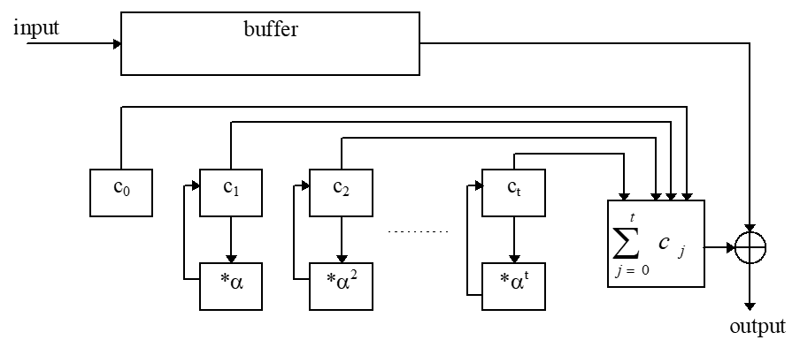
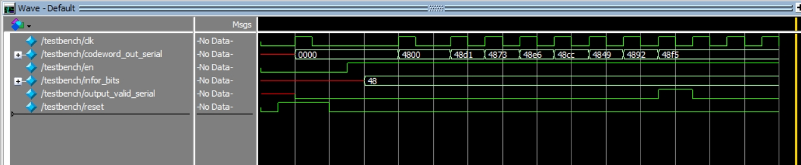
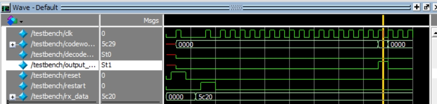

# Final Project: 512B two-error-correcting BCH code

# Overview

This project explores the design and implementation of a 512B 2-error-correcting BCH encoder/decoder system. The system is based on Bose, Chaudhuri, and Hocquenghem (BCH) codes, powerful random error-correcting cyclic codes first discovered in the late 1950s. This project is tailored for applications like satellite communications, digital storage media, and more, where error correction is crucial for maintaining data integrity.

## Introduction

BCH codes belong to a wide class of powerful error-correcting cyclic codes that can be tailored to correct multiple random error patterns. Named after their inventors, they are particularly valued for their robustness and versatility in correcting burst errors and their capability in managing error correction with manageable computational complexity.

## History of BCH codes

The development of BCH codes was a significant milestone in the field of error-correcting codes. The codes were first introduced by mathematicians Raj Bose and Dwijendra Ray-Chaudhuri in 1959 and independently by French mathematician Alexis Hocquenghem in 1959. The codes were initially discovered for correcting random errors in communication channels, but their applications have since expanded to various fields, including digital storage, satellite communications, and more.

## Galois Field
### GF Basics
A Galois Field, denoted as GF(q), is a finite field with q elements, where q is a prime power. The field GF(2^m) is particularly relevant for BCH codes, as it allows for efficient arithmetic operations using binary representations. The field GF(2^m) is constructed using a primitive polynomial of degree m, which generates the field elements.

### GF in BCH codes
In BCH codes, the Galois Field GF(2^m) is used to represent the code elements and perform arithmetic operations. The field elements are represented as binary vectors of length m, with each element corresponding to a unique binary polynomial. The arithmetic operations in GF(2^m) are performed using polynomial addition and multiplication modulo a primitive polynomial. These operations are essential for encoding and decoding BCH codes efficiently. 

## 512B 2-error-correcting encoder

The 512B 2-error-correcting BCH encoder is designed to encode a 512-byte data block using a BCH code with the capability to correct up to 2 errors. The encoder takes the input data block, encodes it using the BCH code, and generates the encoded output. The encoder is implemented using Verilog HDL and is optimized for efficient hardware realization.

### Encoder Architecture

The encoder shown in Figure 3.1 operates as follows
1. for clock cycles 1 to k, the information bits are transmitted in unchanged form (switch S2 in position 2) and the parity bits are calculated in the Linear Feedback Shift Register (LFSR) (switch S1 is on).
2. for clock cycles k+1 to n, the parity bits in the LFSR are transmitted (switch S2 in position 1) and the feedback in the LFSR is switch off  (S1 - off).

## 512B 2-error-correcting decoder
The decoder of BCH codes usually contains three main components: syndrome calculation, Solving the key equation, and finding the error locations. The syndrome calculation is the first step in the decoding process, where the received codeword is multiplied by the parity-check matrix to obtain the syndrome vector. The syndrome vector is then used to solve the key equation, which provides the error locator polynomial. The error locator polynomial is used to find the error locations in the received codeword, which are then corrected to recover the original message.

### Syndrome Calculation

The first step of the decoding process is to store the received polynomial r(x) in a buffer register and to calculate the syndromes Sj (for 1 <=  j  <= 2t -1). The most important feature of the syndromes is that they do not depend on transmitted information but only on error locations, as shown below.

As shown in the figure, the syndromes are calculated by multiplying the received polynomial r(x) by the first 2t powers of x and evaluating the result at α^i, where α is a primitive element of GF(2^m). The syndromes are then stored in a syndrome register for further processing.

### Solving the Key Equation
The key equation is a polynomial equation that relates the error locator polynomial σ(x) to the syndromes Sj. And BMA algorithm is used to solve the key equation.

As shown in the figure, the key equation is solved using the Berlekamp-Massey algorithm, which iteratively updates the error locator polynomial σ(x) based on the discrepancy values. The algorithm terminates after t-1 iterations, where t is the error-correcting capability of the BCH code.

### Finding the Error Locations

The last step in decoding BCH codes is to find the error location numbers. These values are the reciprocals of the roots of σ(x) and may be found simply by substituting the elements of GF(2^m) into σ(x) and checking for a zero result. The error locations are then used to correct the errors in the received codeword and recover the original message.

As shown in the figure, the error locations are found using the Chien search algorithm, which evaluates the error locator polynomial σ(x) at the elements of GF(2^m) to determine the error locations. The algorithm will find and correct up to t errors in the received codeword, allowing for the recovery of the original message.

### Encoder simulation and analysis

As shown in the figure, to simplify the simulation, the encoder is tune to encode a (15, 7) BCH code. The input data is a 7-bit binary number, and the output is a 15-bit codeword. The encoder is tested using a testbench file that generates random input data and verifies the correctness of the encoded output. The simulation results demonstrate the successful encoding of the input data using the BCH code. As the information bits 0x48 are encoded to be 0x48f5.

### Decoder simulation and analysis

As shown in the figure, to simplify the simulation, the decoder is tuned to decode a (15, 7) BCH code. The input data is a 15-bit codeword with up to 2 errors, and the output is the decoded 7-bit message. The decoder is tested using a testbench file that introduces random errors into the received codeword and verifies the correctness of the decoded output. The simulation results demonstrate the successful decoding of the received codeword, with the errors corrected to recover the original message. The simulation results demonstrate teh successful decoding of the received codeword 0x5c20 and after correcting the errors, the correct output codeword is 0x5c29 and as a result, 2 errors are corrected.

## Conclusion

The BCH encoder/decoder includes implementation of complex algorithm for both encoding and decoding. The theoritical encoder is designed to encode a 512-byte data block using a BCH code with the capability to correct up to 2 errors and in the simulation a (15,7) encoding result is shown for simplicity. The decoder is designed to decode the received codeword and correct up to 2 errors to recover the original message and the implementation of the decoder is much harder than the encoder. The simulation results demonstrate the successful encoding and decoding of BCH codes, highlighting the error-correcting capability of the codes. The project provides a comprehensive understanding of BCH codes and their applications in error correction, making them valuable tools in various communication and storage systems.