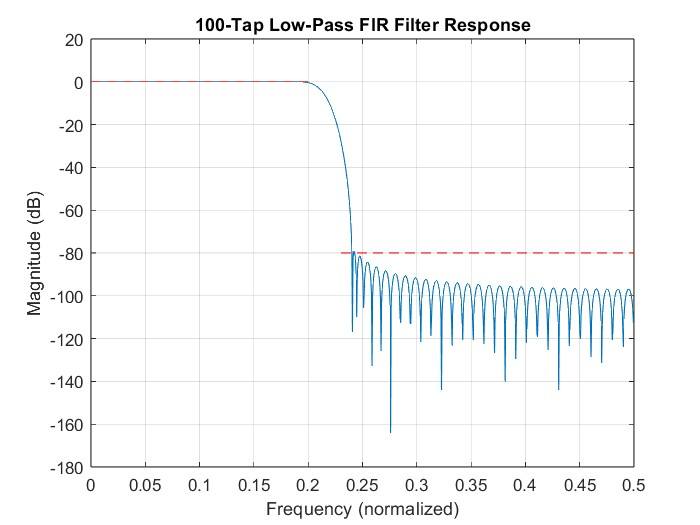
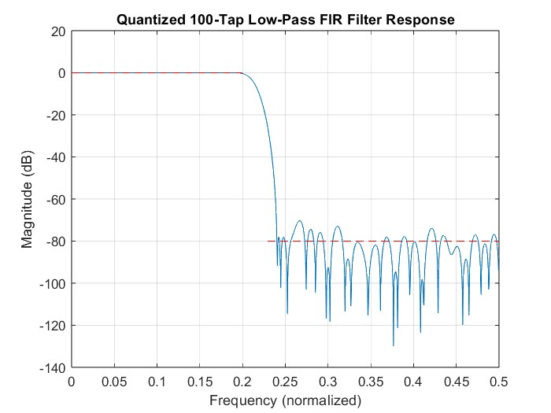

# Project 1: Low-Pass FIR Filter Design and Implementation

# Overview

This project focuses on the design and development of a low-pass Finite Impulse Response (FIR) filter, utilizing MATLAB for the design process and Verilog for its hardware implementation. The design specifications call for a 100-tap filter that operates within a transition band from 0.2π to 0.23π radians per sample, ensuring a minimum stopband attenuation of 80dB. Throughout the project, we will investigate various FIR filter architectures, such as pipelining and reduced-complexity parallel processing, as well as their combinations. The goal is to identify and implement the most efficient architecture for hardware realization, balancing performance with resource utilization.

# MATLAB FIR Filter Design

## Objective
The goal was to design a 100-tap low-pass Finite Impulse Response (FIR) filter with stringent frequency characteristics for digital signal processing applications. The filter was specified to feature a transition region from \(0.2\pi\) to \(0.23\pi\) rad/sample and ensure a stopband attenuation of at least 80 dB, effectively attenuating unwanted frequencies.

## Design Process

1. **Specification Definition**
   - Defined key specifications including transition region and stopband attenuation, tailored to meet performance criteria essential for the target application. The design utilized a normalized frequency approach with \(f_s = 1\) for universal application in the digital domain.

2. **Kaiser Window Method**
   - Employed the Kaiser window method to calculate the filter coefficients. This method is chosen for its ability to adjust the trade-off between mainlobe width and sidelobe level, ideal for achieving high stopband attenuation.

3. **Filter Coefficients Calculation**
   - Determined the Kaiser window parameters, including beta and the filter length (\(N\)), based on the desired attenuation and transition width.
   - Calculated a filter length (\(N = 101\)) to ensure adherence to the 80 dB stopband attenuation requirement and the specified transition region.

4. **MATLAB Implementation**
   - Implemented the filter design in MATLAB using the `fir1` function along with the calculated Kaiser window parameters, yielding the filter coefficients that define the filter’s impulse response.

5. **Quantization**
   - Quantized the floating-point coefficients to fixed-point format with a 32-bit word length (1 sign bit + 31 fractional bits) to preserve filter characteristics for hardware implementation.

6. **Performance Analysis**
   - Analyzed the frequency response of both the original and quantized filters using MATLAB's `freqz` function, confirming compliance with the specified transition region and stopband attenuation.

Fig.1 and Fig.2 shows the FIR filter's pre-quantized and quantized response.

Fig.1: Pre-quantized FIR filter frequency response

Fig.2: Quantized FIR filter frequency response

